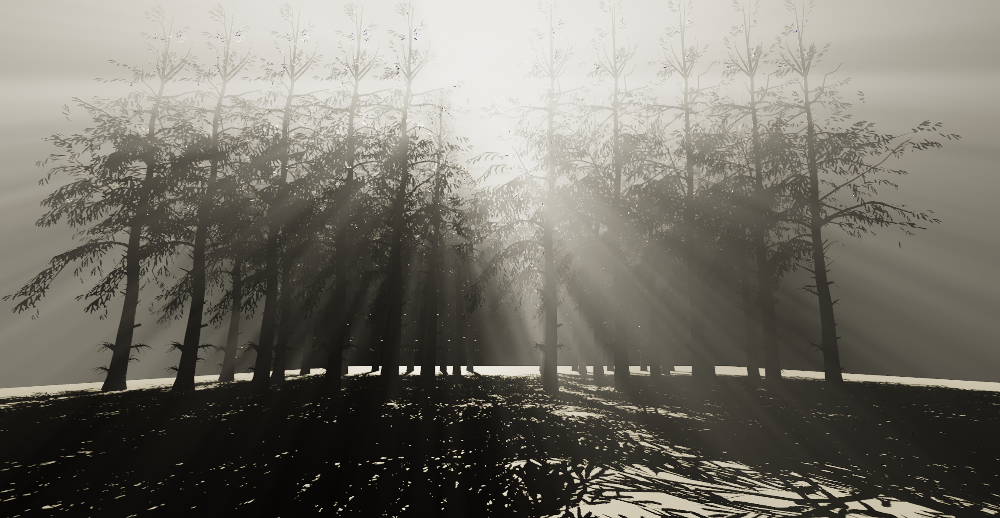

# Unity Volumetric Light

## Features:
* Volumetric light in current real-time rendering could be expensive in PC and PS4, so we use downsample and jitter to optimize the performance.
* Native directional shadowmap supported.
* Cascade Directional Shadow supported.
* Mie Scattering supported.
* Height Fog Supported.

## Tutorial:
* Add "VolumetricLightRenderer.cs" on scene render camera.
* Choose downsample level in "VolumetricLightRenderer.cs", for instance: x2 is half resolution, x3 is one third resolution and x4 is one quater resolution. The less resolution will cause better performance and worse quality.
* Add "VolumetricLight.cs" on the directional light.
* Enable "Hard Shadow" or "Soft Shadow" to let volumetric light component use shadowmap.